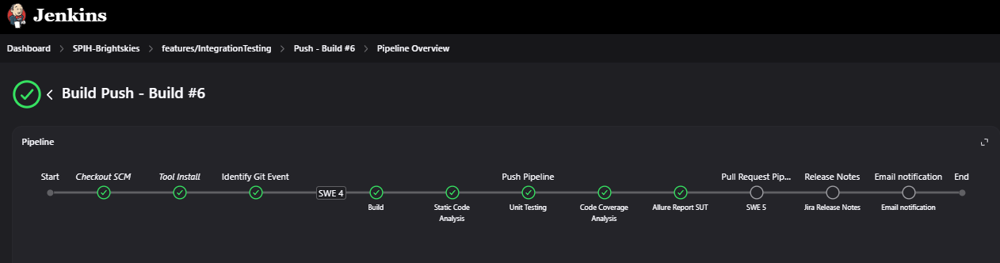

# CI Tools Installation Guide ☁️

This guide provides detailed steps to configure CI/CD pipelines for the AUTOSAR_SPI_Handler project using Jenkins. After completing the Jenkins and Docker setup from the [CI-CD-Jenkins README](https://github.com/AhmedSamymoh/CI-CD-Jenkins/blob/main/README.md#project-setup-guide-).



### Prerequisites
- Jenkins accessible at `http://localhost:8083`
- Docker running with Jenkins container

---

## Create Multibranch Pipeline

1. **Navigate to Jenkins Dashboard**
   - Click "New Item" in the left sidebar
   - Enter name: `SPI_Handler_CI`
   - Select "Multibranch Pipeline"

2. **Configure Pipeline**
   ```text
   Branch Sources:
   - Add Source: GitHub
     - Credentials: Add your GitHub credentials (ID: git-credentials)
     - Repository HTTPS URL: https://github.com/AhmedSamymoh/AUTOSAR_SPI_Handler
   
   Build Configuration:
   - Script Path: `Tools/Jenkinsfile`

   ## Step 2: Install Allure Plugin & Setup Windows Agent

## Install Allure Reporting Plugin

1. Go to: Manage Jenkins > Plugins > Available plugins
2. Search for "Allure Jenkins Plugin"
3. Install without restart
2. Configure Allure Commandline

### In Global Tool Configuration:
- Allure Commandline:
  - Name: `allure-2.24` OR `allure`

## Setting up a Jenkins agent

1. Go to "Manage Jenkins" > "Manage Nodes and Clouds"
2. Click "New Node"
3. Configure:
   - Node name: "Windows"
   - Type: "Permanent Agent"

   - Remote root: Should be a path to run into the machine

    

   - Launch method: "Launch agent via Java Web Start"
 
    

4. Save and use secret from node configuration page


